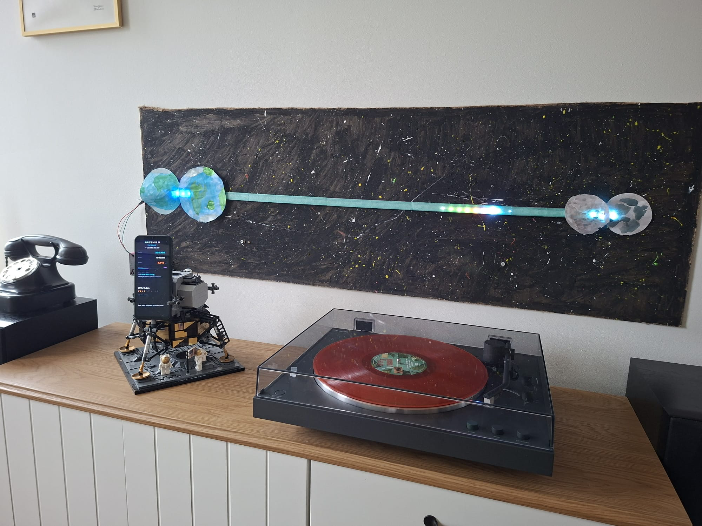

# Artemis II Live Tracker

A real-time LED strip + phone dashboard that tracks NASA's Artemis II spacecraft on its journey to the Moon and back, using live telemetry from JPL Horizons.

Built during the live mission (April 1-11, 2026) as a family weekend project.



## What It Does

- **60-LED strip** shows spacecraft position between Earth and Moon in real-time
- **Android phone dashboard** displays live stats, milestone countdowns, and AI-generated fun facts
- **Startup animation** — rocket flies from Earth to current position on each power-on
- **Phase-aware effects** — different visuals for outbound, lunar flyby, return, reentry, and splashdown
- **Fully autonomous** — plug in power, everything starts automatically

## Hardware

| Component | Details |
|-----------|---------|
| Raspberry Pi 5 | Running the tracker software |
| WS2812 LED Strip | 60 LEDs, 1m, 5V, addressable RGB |
| Android Phone | Samsung Galaxy A13 (any Android with USB debugging works) |
| 5V Power Supply | 4A+ for Pi + LED strip |
| 3D Printed Channel | LED diffuser with translucent PETG cap |

### Wiring

```
Pi GPIO 10 (SPI MOSI, Pin 19) → LED Strip DIN
Pi Pin 2 (5V)                  → LED Strip VCC
Pi Pin 6 (GND)                 → LED Strip GND
Phone                          → Pi USB port (ADB)
```

## LED Effects

```
[Earth 🔵🔵🔵] · · · · ★🚀🔴🟠🟡· · · · · · [🌕🌕🌕 Moon]
  bright blue                                   bright white
  3 LEDs          rocket + exhaust plume         3 LEDs
```

| Phase | Effect |
|-------|--------|
| **Outbound** | Blue-white capsule + red/orange/yellow exhaust plume |
| **Flyby** | Blue shimmer near Moon, golden pulse when distance record broken |
| **Return** | Comet tail flips direction |
| **Reentry** | Fireball mode — red-hot rapid flicker, heat glow on Earth end |
| **Splashdown** | Rainbow celebration → ocean breathing → trophy mode |

## Phone Dashboard

Space-themed fullscreen dashboard via FastAPI + WebSocket:

- Live distance from Earth/Moon, speed, MET
- Mission progress bar
- Next milestone countdown with emoji timeline
- AI-powered fun facts (Gemini API, refreshed hourly)

## Data Source

**JPL Horizons API** — NASA's authoritative ephemeris system. The spacecraft is tracked as ID `-1024`. No API key needed. Polled every 5 minutes with exponential backoff on failure and position interpolation between polls.

## Quick Start

### On the Raspberry Pi 5

```bash
# Clone
git clone https://github.com/stepankaiser/artemis-tracker.git
cd artemis-tracker

# Setup (installs Python venv, LED/OLED libraries, enables SPI/I2C)
bash setup_pi.sh

# Run in demo mode (simulates full mission in 2 minutes)
source .venv/bin/activate
python -m artemis --demo

# Run live (real Artemis II data)
python -m artemis
```

### Phone Display

Connect an Android phone with USB debugging enabled:

```bash
bash setup_phone.sh
```

### Auto-Start on Boot

```bash
sudo cp artemis-tracker.service /etc/systemd/system/
sudo cp artemis-phone.service /etc/systemd/system/
sudo systemctl daemon-reload
sudo systemctl enable artemis-tracker artemis-phone
```

## Project Structure

```
artemis/
├── tracker.py        # Main loop — 30fps LED rendering, 1Hz display updates
├── horizons.py       # JPL Horizons API client with interpolation & backoff
├── leds.py           # LED effects engine — all mission phases
├── display.py        # SSD1306 OLED driver (optional, if you have one)
├── web.py            # FastAPI + WebSocket server for phone dashboard
├── dashboard.html    # Space-themed responsive dashboard
├── facts.py          # Gemini-powered fun fact generator
└── config.py         # Mission timeline, milestones, crew data
```

## Raspberry Pi 5 Notes

The Pi 5 uses the RP1 I/O chip which changes how SPI and I2C work:

- **SPI**: Device is `/dev/spidev10.0` (not `spidev0.0`). Pins must be set to alt function with `pinctrl set 10 a0` before each start.
- **I2C**: Hardware I2C may be on bus 1 or 3 depending on overlays. The code auto-detects.
- **LED Library**: Uses `adafruit-circuitpython-neopixel-spi` (the classic `rpi_ws281x` doesn't work on Pi 5).

## Mission Timeline

| Event | Date (UTC) | Status |
|-------|-----------|--------|
| Launch | Apr 1, 22:35 | Completed |
| TLI Burn | Apr 2, 23:49 | Completed |
| Lunar SOI Entry | Apr 6, 04:43 | Upcoming |
| Lunar Flyby (6,513 km) | Apr 6, 23:06 | Upcoming |
| Max Distance Record | Apr 6, 23:09 | Upcoming |
| Splashdown | Apr 11, 00:17 | Upcoming |

## Built With

- Python 3.13, FastAPI, uvicorn
- adafruit-circuitpython-neopixel-spi
- JPL Horizons API
- Google Gemini API (fun facts)
- Bambu Lab A1 Mini (3D printed LED channel)

## License

MIT

---

Built with a lot of excitement during the Artemis II mission by Stepan Kaiser and family, with help from [Claude Code](https://claude.ai/claude-code).
